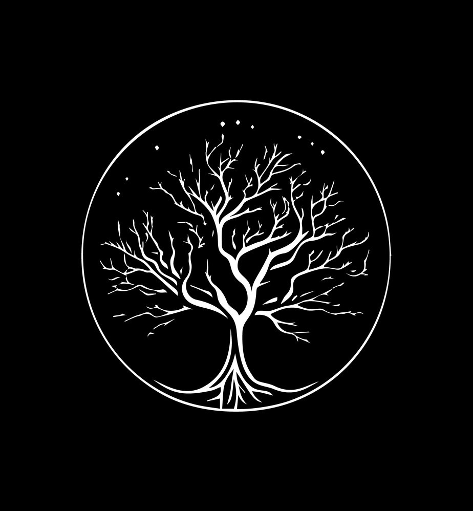

## HERITAGE

This is a project that shows the family tree of the [Kyrgyz](https://ru.wikipedia.org/wiki/%D0%9A%D0%B8%D1%80%D0%B3%D0%B8%D0%B7%D1%8B) people. And you can see yourself and search for yourself (if you are Kyrgyz, of course) in the tree.



## How to contribute

If you want to contribute to the project, you can do the following:

- Add yourself and your fathers
- Fix some bugs on the site
- To give ideas for improving the site
- Report any wrong paths in the family tree
- Etc.

The best way to contribute is to fork the project and make a pull request. If you have any questions, you can write to me on [Telegram](https://t.me/warioddly).


## What You must know before contributing

The project is written in Next.js and if you want to contribute, you must know the following:

- History of the Kyrgyz people
- The family tree of your family if you add yourself
- [Learn Next.js](https://nextjs.org/learn) - an interactive Next.js tutorial.
- [Learn React](https://reactjs.org/tutorial/tutorial.html) - an interactive React tutorial.
- [Learn TypeScript](https://www.typescriptlang.org/docs/handbook/intro.html) - an interactive TypeScript tutorial.
- [Learn Tailwind CSS](https://tailwindcss.com/docs) - an interactive Tailwind CSS tutorial.

And it is not necessary to know the technology above, you can write your ideas, etc. (read the section [How to contribute](#how-to-contribute)).


## How to run the project
First, run the development server:

```bash
npm run dev
# or
yarn dev
# or
pnpm dev
# or
bun dev
```

Open [http://localhost:3000](http://localhost:3000) with your browser to see the result.

Wish you a good contribution! 🚀
